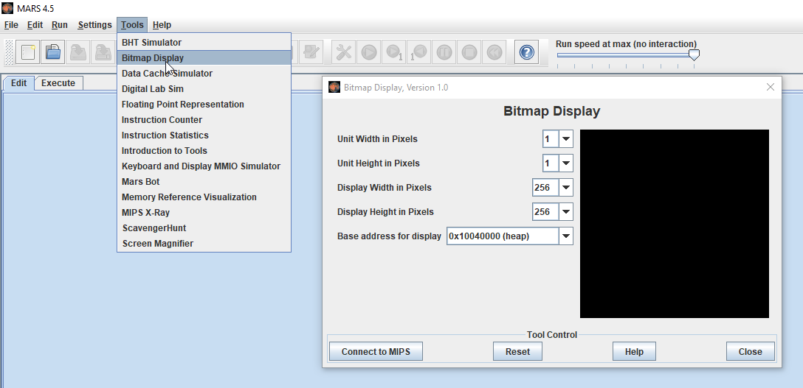
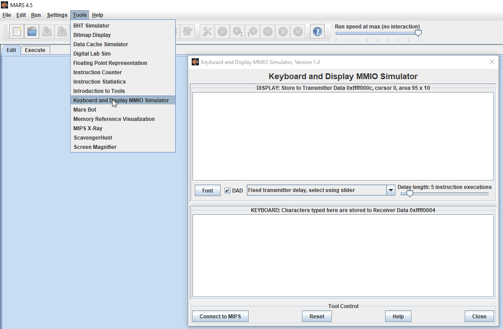
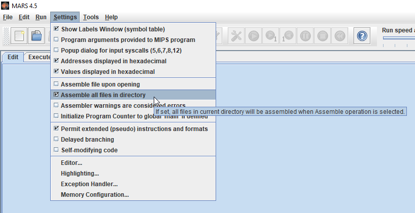

## MIPS Snake
This is a MIPS implementation of the classic game, "Snake."

**Game Play**
You control the snake by changing it's direction. The snake moves up, down, left, or right at a constant speed. The goal is to collect as many pieces of food (green tiles) as possible while not running into the border of the display, or colliding the snake's head with any part of its body which will end the game.
When a piece of food is collected, your score increases by one and the snake's body length also increases by one (by way of continuing the movement of the head but pausing the update of the tail for one frame).
Use the w, a, s, and d keys to change the direction of the Snake. Input must be entered into the Keyboard Simulator (more on this below).

**Environment Setup**
This implementation was designed and tested using [MARS MIPS emulator](https://courses.missouristate.edu/KenVollmar/MARS/download.htm), which is cross-platform and written in Java. There are some important steps to follow before attempting to run the program:

 - You must enable the bitmap display with the following configuration. After matching these settings, be sure to click "Connect to MIPS" before running the program.

 - Additionally, user input is handled using the keyboard simulator (not the console window). Similar to the Bitmap Display Simulator, make sure you click "Connect To MIPS" before running the program. Also make sure you have the bottom text field selected after you start the program to enter your inputs.

- Finally, since the source code is split amongst multiple files, make sure the "Assemble all files in directory" option is selected:

- That's it for the setup. All you have to do now is open main.asm in MARS, assemble it, and run.

**Why?**
I wrote this for the final project of my CMPEN 351 course with Penn State World Campus in December 2019. Why snake? I don't remember my reasons, but probably because I knew it would be sufficiently challenging while also being attainable in the short amount of time I had to complete it. I also have some fond memories playing different versions of the game as far back as on my mom's old Nokia cell phone in the early 2000's.

**What's Next?**
For this project? Likely nothing. I just wanted to put it here since it was fun, significantly challenging, and relatively complete. I don't plan on making any changes but others are welcome to fork this if for some reason they want to.

Special thanks to Prof. Tim Sichler at Penn State for his support and encouragement throughout the process and for teaching me MIPS assembly in the first place.
